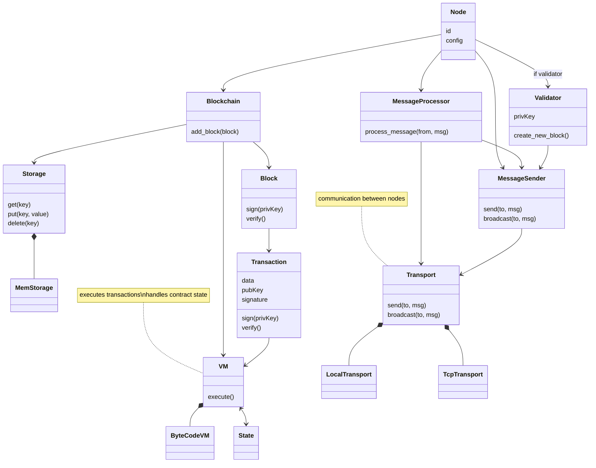
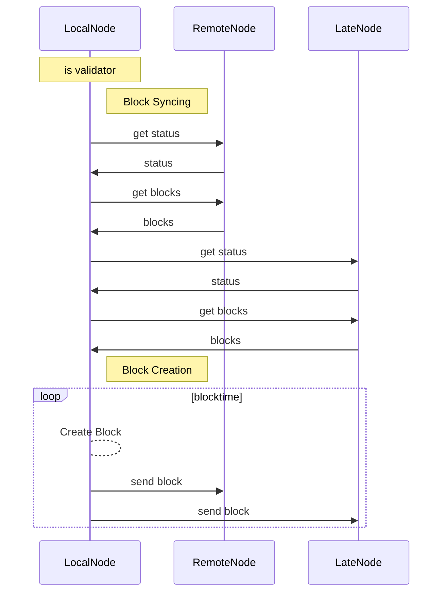

# Muckchain
Simple modular blockchain written in Rust.

### modules

- config (contains the config)
- core (contains the blockchain, blocks, transactions, etc.)
- net (contains everything related to networking, like the transport layer, message processor, etc.)
- crypto (contains the crypto stuff, like the private key, signature, etc.)

### modular parts

- Encoding
- VM
- State (State for VM)
- BlockValidator
- Transport (Local, TCP, UDP)
- Storage (used to store blocks)
- Hasher (used to hash Transactions, Blocks, etc.)

### Simple Class Diagram

### Node communication

### Roadmap

- add multiple consensus algorithms
- add multiple vm's (maybe support a webscraping vm?)

