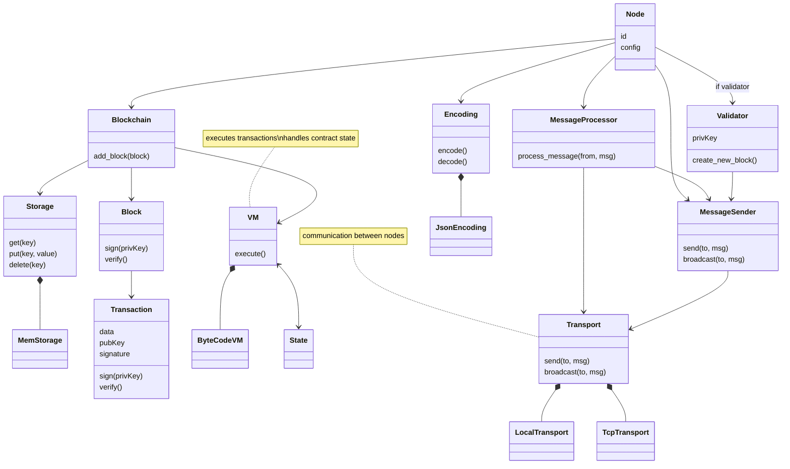

# Muckchain
Simple blockchain written in Rust.

```mermaid
classDiagram
  Node --> Validator: if validator
  Node --> MessageProcessor
  Node --> MessageSender
  Node --> Blockchain
  Node --> Encoding
  Node: id
  Node: config
  Blockchain --> VM
  Blockchain --> Block
  Blockchain --> Storage
  Storage: get(key)
  Storage: put(key, value)
  Storage: delete(key)
  Storage *-- MemStorage
  Block --> Transaction
  Block: sign(privKey)
  Block: verify()
  Transaction: sign(privKey)
  Transaction: verify()
  Transaction: data
  Transaction: pubKey
  Transaction: signature
  Blockchain: add_block(block)
  VM *-- ByteCodeVM
  VM: execute()
  note for VM "executes transactions\nhandles contract state"
  VM <--> State
  Encoding *-- JsonEncoding
  Transport *-- LocalTransport
  Transport *-- TcpTransport
  Transport: send(to, msg)
  Transport: broadcast(to, msg)
  note for Transport "communication between nodes"
  MessageProcessor --> MessageSender
  MessageProcessor --> Transport
  MessageProcessor: process_message(from, msg)
  MessageSender: send(to, msg)
  MessageSender: broadcast(to, msg)
  MessageSender --> Transport
  Validator --> MessageSender
  Validator: privKey
  Validator: create_new_block()
  Encoding: encode()
  Encoding: decode()


```

